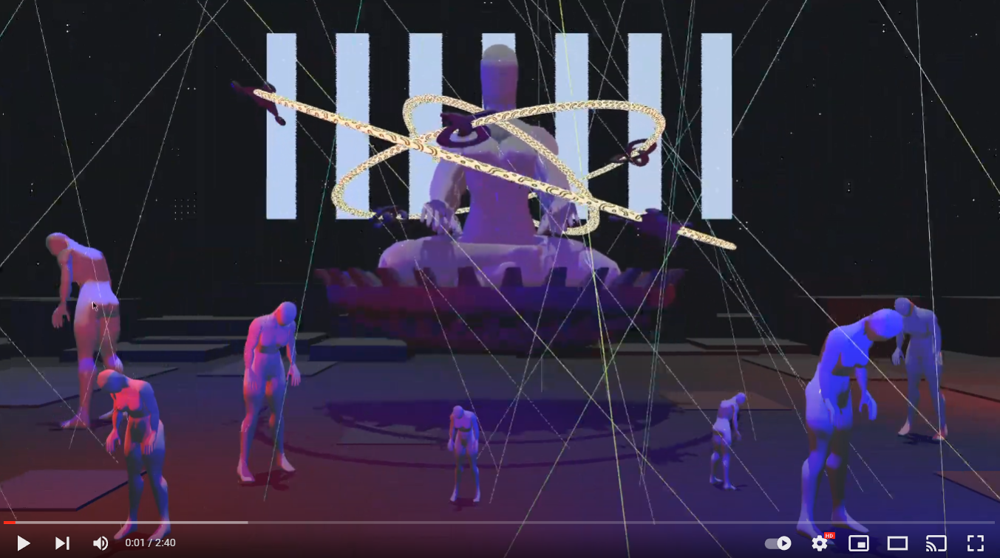

# Puredata-Unity

## Info
> This was the midterm project of the class 2021 Digital Sound Art and Creation at NTU.

The project used [LibPdIntegration](https://github.com/LibPdIntegration/LibPdIntegration) for communication between pure data and Unity.

Several instruments were implemented in pure data, each with 6 built in tempos.

## Control
- Left click on a person: Start playing the corresponding instruments / Switch to the next tempo.
- Middle click on a person: Switch to a random tempo.
- Right click on a person: Stop playing the corresponding instruments.
- ESC: exit the program.

## Demo

- Direct link: https://www.youtube.com/watch?v=uBnFkn11qOM
